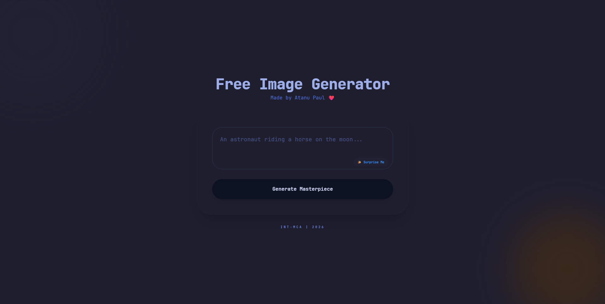

# 🎨 Free Image Generator
A premium, aesthetic AI image generation tool built with **Cloudflare Workers AI** and the **FLUX.1-schnell** model.

## 📸 Preview

## 🚀 Features
- **Flux.1-schnell AI:** High-fidelity image generation in 8 steps.
- **Modern UI:** Glassmorphism design with animated floating elements.
- **Safety Filters:** Graceful handling of restricted content.
- **Serverless Backend:** Built on Cloudflare Workers for global speed.

## 🛠️ Tech Stack
- **Frontend:** Tailwind CSS, JavaScript (ES6+).
- **Backend:** Cloudflare Workers (JavaScript).
- **AI Model:** `@cf/black-forest-labs/flux-1-schnell`.

## ⚙️ Security Note
This project hides the `API_KEY` using environment variables and Cloudflare Secret injection to ensure the backend stays secure while the frontend remains public.

## 👨‍💻 Author
**Atanu Paul** *Int-MCA Student | 2026*
