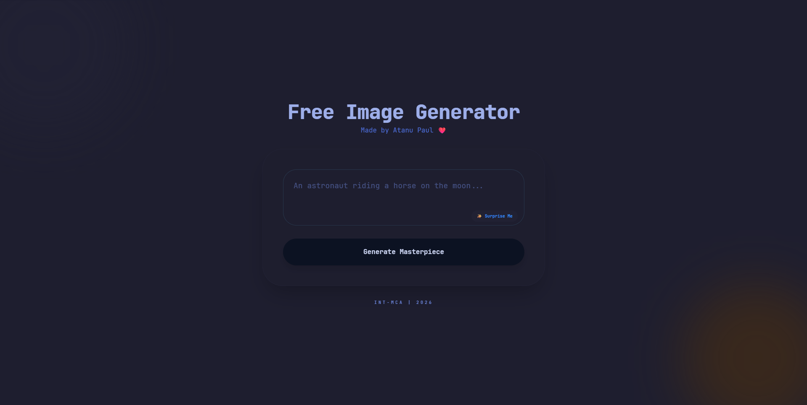

# ✨ Free Image Generator

Welcome to my project! This is a labor of love where I've combined the power of **Cloudflare Workers AI** with a sleek, modern design to create a seamless image generation experience. It's built using the **FLUX.1-schnell** model to turn your wildest imaginations into reality in seconds.

## 📸 See it in Action

## 🌟 What makes it special?
- **Blazing Fast AI:** Harnesses the FLUX.1-schnell model for high-quality, 8-step generation.
- **Crafted with Care:** A bespoke UI featuring deep glassmorphism, vibrant neon accents, and smooth animations.
- **Privacy First:** I've built this with security in mind, using environment variables to keep API keys hidden while the app stays open-source.
- **Global & Serverless:** Runs on Cloudflare's edge network, so it's fast no matter where you are.

## 🛠️ The Tech Behind the Magic
- **Design:** Vanilla CSS + Tailwind CSS (Aesthetic matters!)
- **Logic:** Modern JavaScript (ES6+)
- **Brain:** Cloudflare Workers AI with the FLUX model.

## 💡 Why I built this
As an Int-MCA student, I'm always looking for ways to push the boundaries of what's possible with web tech. This project was a challenge to myself to create something that's not just functional, but truly *aesthetic*.

---
**Made with ❤️ by Atanu**
*Int-MCA Student | Class of 2026*
